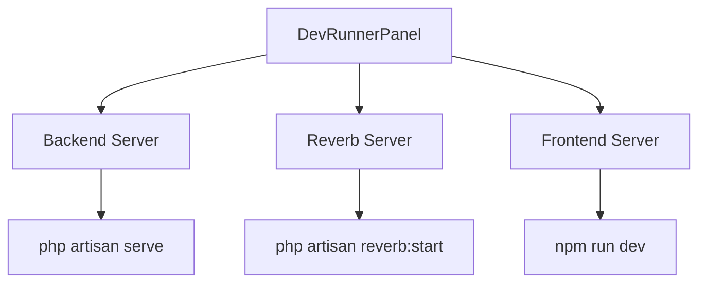

# Design Document

## Overview

This feature extends the DevRunnerPanel to manage three servers: Backend, Reverb, and Frontend. The Reverb server provides local WebSocket functionality for real-time communication in the tabulation system.

## Architecture



## Components and Interfaces

### Modified Components

#### DevRunnerPanel (`lib/screens/widgets/dev_runner_panel.dart`)
- Manages three server processes: backend, reverb, frontend
- Each server has start/stop controls and status indicator
- Right-click to edit commands
- Commands persisted to `database.json`

## Data Models

### Commands Storage (`database.json`)
```json
{
  "backendCommand": "php artisan serve",
  "reverbCommand": "php artisan reverb:start",
  "frontendCommand": "npm run dev"
}
```

## Server Configuration

| Server | Default Command | Port | Color |
|--------|----------------|------|-------|
| Backend | `php artisan serve` | 8000 | Blue |
| Reverb | `php artisan reverb:start` | 8080 | Teal |
| Frontend | `npm run dev` | 5173 | Orange |

## Error Handling

| Error Scenario | Handling Strategy |
|----------------|-------------------|
| Process fails to start | Log error, update UI to stopped state |
| Process exits unexpectedly | Update UI to stopped state |
| Backend path not set | Disable start buttons for Backend and Reverb |

## Testing Strategy

### Manual Testing
- Start/stop each server individually
- Verify status indicators update correctly
- Test command editing and persistence
- Test terminal switching functionality
