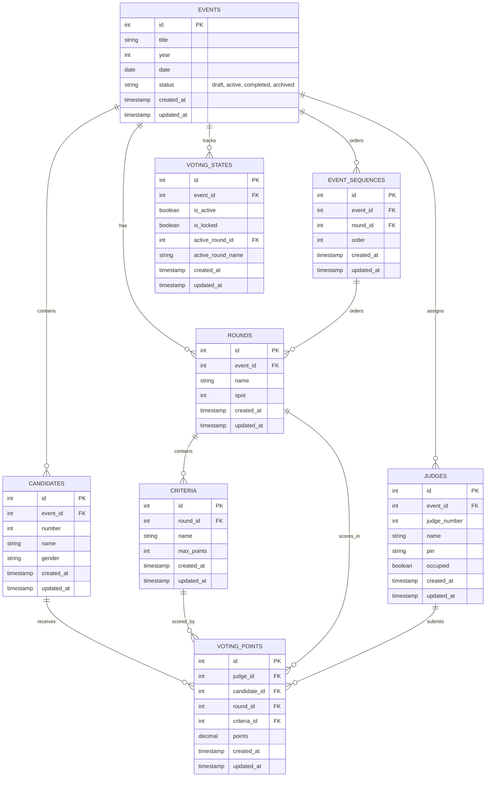

# Entity Relationship Diagram (ERD)

## Database Schema Overview

The TCC Tabulation System uses a normalized MySQL database with the following entity relationships:

## Complete ERD



## Table Descriptions

### EVENTS
Stores event information and overall status.

| Column | Type | Description |
|--------|------|-------------|
| id | INT | Primary key |
| title | VARCHAR | Event title (e.g., "Miss Universe 2024") |
| year | INT | Year of event |
| date | DATE | Event date |
| status | VARCHAR | Event status: draft, active, completed, archived |
| created_at | TIMESTAMP | Creation timestamp |
| updated_at | TIMESTAMP | Last update timestamp |

### CANDIDATES
Stores participant/candidate information.

| Column | Type | Description |
|--------|------|-------------|
| id | INT | Primary key |
| event_id | INT | Foreign key to EVENTS |
| number | INT | Candidate number |
| name | VARCHAR | Candidate name |
| gender | VARCHAR | Gender/Category |
| created_at | TIMESTAMP | Creation timestamp |
| updated_at | TIMESTAMP | Last update timestamp |

### ROUNDS
Stores judging rounds/categories.

| Column | Type | Description |
|--------|------|-------------|
| id | INT | Primary key |
| event_id | INT | Foreign key to EVENTS |
| name | VARCHAR | Round name (e.g., "Preliminary", "Final") |
| spot | INT | Round order/spot |
| created_at | TIMESTAMP | Creation timestamp |
| updated_at | TIMESTAMP | Last update timestamp |

### CRITERIA
Stores scoring criteria for each round.

| Column | Type | Description |
|--------|------|-------------|
| id | INT | Primary key |
| round_id | INT | Foreign key to ROUNDS |
| name | VARCHAR | Criteria name (e.g., "Presentation", "Talent") |
| max_points | INT | Maximum points for this criteria |
| created_at | TIMESTAMP | Creation timestamp |
| updated_at | TIMESTAMP | Last update timestamp |

### JUDGES
Stores judge information and occupation status.

| Column | Type | Description |
|--------|------|-------------|
| id | INT | Primary key |
| event_id | INT | Foreign key to EVENTS |
| judge_number | INT | Judge slot number (1-5) |
| name | VARCHAR | Judge name |
| pin | VARCHAR | Judge PIN for login |
| occupied | BOOLEAN | Whether slot is currently occupied |
| created_at | TIMESTAMP | Creation timestamp |
| updated_at | TIMESTAMP | Last update timestamp |

### VOTING_POINTS
Stores individual judge scores for candidates.

| Column | Type | Description |
|--------|------|-------------|
| id | INT | Primary key |
| judge_id | INT | Foreign key to JUDGES |
| candidate_id | INT | Foreign key to CANDIDATES |
| round_id | INT | Foreign key to ROUNDS |
| criteria_id | INT | Foreign key to CRITERIA |
| points | DECIMAL | Score given (0-max_points) |
| created_at | TIMESTAMP | Creation timestamp |
| updated_at | TIMESTAMP | Last update timestamp |

### VOTING_STATES
Tracks current voting state and active round.

| Column | Type | Description |
|--------|------|-------------|
| id | INT | Primary key |
| event_id | INT | Foreign key to EVENTS |
| is_active | BOOLEAN | Whether voting is active |
| is_locked | BOOLEAN | Whether judge screens are locked |
| active_round_id | INT | Currently active round ID |
| active_round_name | VARCHAR | Currently active round name |
| created_at | TIMESTAMP | Creation timestamp |
| updated_at | TIMESTAMP | Last update timestamp |

### EVENT_SEQUENCES
Stores the ordered sequence of rounds for an event.

| Column | Type | Description |
|--------|------|-------------|
| id | INT | Primary key |
| event_id | INT | Foreign key to EVENTS |
| round_id | INT | Foreign key to ROUNDS |
| order | INT | Position in sequence |
| created_at | TIMESTAMP | Creation timestamp |
| updated_at | TIMESTAMP | Last update timestamp |

## Key Relationships

### One-to-Many Relationships

1. **EVENTS → CANDIDATES**
   - One event has many candidates
   - Used to store all participants for an event

2. **EVENTS → ROUNDS**
   - One event has many rounds
   - Each round represents a judging category

3. **ROUNDS → CRITERIA**
   - One round has many criteria
   - Each criteria is scored separately

4. **EVENTS → JUDGES**
   - One event has many judges
   - Tracks which judges are assigned to an event

5. **JUDGES → VOTING_POINTS**
   - One judge submits many scores
   - Each score is for a specific candidate/criteria combination

6. **CANDIDATES → VOTING_POINTS**
   - One candidate receives many scores
   - From different judges and criteria

7. **ROUNDS → VOTING_POINTS**
   - One round has many scores
   - Scores are grouped by round

8. **CRITERIA → VOTING_POINTS**
   - One criteria has many scores
   - Each judge scores each candidate on each criteria

9. **EVENTS → VOTING_STATES**
   - One event has one voting state
   - Tracks current voting status

10. **EVENTS → EVENT_SEQUENCES**
    - One event has many sequence entries
    - Defines the order of rounds

## Data Flow Example

### Typical Event Workflow

```
1. Create Event
   ↓
2. Add Candidates to Event
   ↓
3. Create Rounds for Event
   ↓
4. Add Criteria to each Round
   ↓
5. Create Event Sequence (order rounds)
   ↓
6. Activate Event (create VOTING_STATE)
   ↓
7. Activate First Round
   ↓
8. Judges occupy slots
   ↓
9. Judges submit scores (VOTING_POINTS)
   ↓
10. Admin locks/unlocks screens
    ↓
11. Move to next round (update VOTING_STATE)
    ↓
12. Repeat steps 7-11 for each round
    ↓
13. Complete event (update EVENTS.status)
```

## Indexes

For optimal performance, the following indexes are recommended:

```sql
-- Foreign key indexes
CREATE INDEX idx_candidates_event_id ON candidates(event_id);
CREATE INDEX idx_rounds_event_id ON rounds(event_id);
CREATE INDEX idx_criteria_round_id ON criteria(round_id);
CREATE INDEX idx_judges_event_id ON judges(event_id);
CREATE INDEX idx_voting_points_judge_id ON voting_points(judge_id);
CREATE INDEX idx_voting_points_candidate_id ON voting_points(candidate_id);
CREATE INDEX idx_voting_points_round_id ON voting_points(round_id);
CREATE INDEX idx_voting_points_criteria_id ON voting_points(criteria_id);
CREATE INDEX idx_voting_states_event_id ON voting_states(event_id);
CREATE INDEX idx_event_sequences_event_id ON event_sequences(event_id);
CREATE INDEX idx_event_sequences_round_id ON event_sequences(round_id);

-- Composite indexes for common queries
CREATE INDEX idx_voting_points_composite ON voting_points(judge_id, candidate_id, round_id);
CREATE INDEX idx_voting_points_event_round ON voting_points(round_id, candidate_id);
```

## Constraints

### Primary Keys
All tables have auto-incrementing integer primary keys.

### Foreign Keys
All foreign key relationships are enforced with ON DELETE CASCADE where appropriate.

### Unique Constraints
- `candidates`: (event_id, number) - Candidate numbers must be unique per event
- `judges`: (event_id, judge_number) - Judge numbers must be unique per event
- `rounds`: (event_id, spot) - Round spots must be unique per event
- `event_sequences`: (event_id, round_id) - Each round appears once per event

### Check Constraints
- `voting_points.points`: Must be between 0 and criteria.max_points
- `events.status`: Must be one of: draft, active, completed, archived
- `judges.judge_number`: Must be between 1 and 5

## Normalization

The schema follows **Third Normal Form (3NF)**:

1. **1NF**: All attributes are atomic (no repeating groups)
2. **2NF**: All non-key attributes depend on the entire primary key
3. **3NF**: No transitive dependencies between non-key attributes

This ensures:
- Data integrity
- Minimal redundancy
- Efficient queries
- Easy maintenance

## Migration Files

All tables are created via Laravel migrations in `database/migrations/`:

- `create_events_table.php`
- `create_candidates_table.php`
- `create_rounds_table.php`
- `create_criteria_table.php`
- `create_judges_table.php`
- `create_voting_points_table.php`
- `create_voting_states_table.php`
- `create_event_sequences_table.php`
